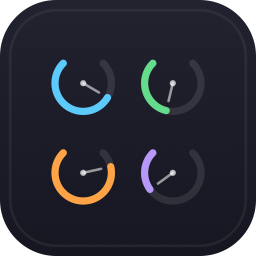

<p align="center">
  
</p>

<h1 align="center">ProcessScope</h1>

<p align="center">
  <strong>See what your processes are actually doing</strong><br>
  A native macOS system monitor built for depth, not just dashboards.
</p>

<p align="center">
  <a href="https://github.com/wilkinsonre/process-scope/releases/latest"></a>
  
  
  <a href="LICENSE"></a>
  <a href="https://github.com/wilkinsonre/process-scope/actions/workflows/ci.yml"></a>
</p>

<br>

<p align="center">
  <!-- screenshot: main-overview.png — full app window showing process list with introspection panel -->
  
</p>

<p align="center">
  <!-- screenshot: module-detail.png — expanded module view (e.g. GPU & Neural Engine) -->
  
  &nbsp;&nbsp;
  <!-- screenshot: process-introspection.png — deep process introspection panel -->
  
</p>

<br>

---

## Install

### Homebrew (recommended)

```sh
brew tap wilkinsonre/process-scope
brew install --cask processcope
```

### Direct download

Download the latest `.dmg` from [GitHub Releases](https://github.com/wilkinsonre/process-scope/releases).

Mount the image, drag ProcessScope to Applications, and launch.

---

## Features

ProcessScope provides twelve focused monitoring modules, each designed to surface actionable detail rather than summary metrics.

| Module | What it shows |
|---|---|
| **CPU** | Per-core utilization, frequency scaling, process attribution per core |
| **Memory** | Pressure state, per-process footprint breakdown, swap and compressed memory |
| **GPU & Neural Engine** | Metal workload attribution, ANE task scheduling, thermal contribution |
| **Processes** | Deep introspection — open files, network connections, dylibs, entitlements |
| **Storage** | Volume health, per-process I/O rates, eject and mount controls |
| **Network** | Per-process connection map, bandwidth attribution, DNS and route inspection |
| **Bluetooth** | Connected device inventory, signal quality, battery levels |
| **Power & Thermal** | SMC sensor readings, fan curves, per-process energy impact attribution |
| **Audio** | Active audio streams, per-process routing, device configuration |
| **Display** | Refresh rate, color profile, per-app GPU compositing cost |
| **Security** | SIP status, entitlement audit, TCC permission inventory per process |
| **Developer** | Docker container management, Xcode process grouping, daemon inspection |

Every module is independently toggleable. Disabled modules have zero overhead — no polling, no history buffers, no XPC subscriptions.

---

## What makes it different

Most system monitors show you **that** a process is consuming resources. ProcessScope shows you **what** it is doing and **why**.

<table>
<tr>
<td width="50%">

**Deep process introspection**

Select any process to inspect its open file descriptors, active network connections, loaded dylibs, Mach ports, sandbox profile, and entitlements. No terminal required.

</td>
<td width="50%">

**Action control surface**

Kill or suspend processes, eject drives, manage Docker containers, and toggle launch daemons directly from the interface. Every action is confirmation-gated and audit-logged.

</td>
</tr>
<tr>
<td width="50%">

**Attribution, not aggregation**

Resource consumption is traced back to specific processes across every module. CPU, GPU, network, disk, and energy metrics all answer "who is responsible."

</td>
<td width="50%">

**Native performance**

Built in Swift with SwiftUI. No Electron, no web views. Uses kernel-level APIs and private framework introspection where available, falling back gracefully when permissions are restricted.

</td>
</tr>
</table>

---

## Requirements

| | Minimum |
|---|---|
| macOS | 15.0 (Sequoia) |
| Architecture | Apple Silicon (M1 or later) |
| Disk space | ~25 MB |

Full Disk Access and Accessibility permissions are requested on first launch to enable deep introspection. The app functions with reduced capability if these are declined.

---

## Build from source

Requires Xcode 16+ and [XcodeGen](https://github.com/yonaskolb/XcodeGen).

```sh
git clone https://github.com/wilkinsonre/process-scope.git
cd process-scope
brew install xcodegen

xcodegen generate

xcodebuild -project ProcessScope.xcodeproj \
  -scheme ProcessScope \
  -configuration Release \
  -derivedDataPath build \
  build
```

The resulting `.app` bundle will be in `build/Build/Products/Release/`.

To run tests:

```sh
xcodebuild -project ProcessScope.xcodeproj \
  -scheme ProcessScopeTests \
  -configuration Debug \
  test
```

---

## License

MIT — see [LICENSE](LICENSE) for details.
